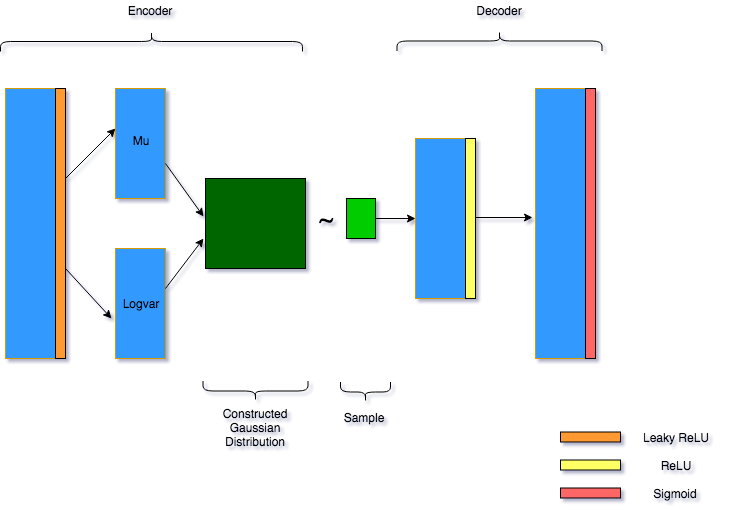

# Variational Autoencoder in NumPy
This is a full implementation of a simple VAE written entirely in Numpy (and Cupy). The code runs very slow on CPU so using a GPU with Cupy is recommended.

Original Paper: [Auto-Encoding Variational Bayes](https://arxiv.org/abs/1312.6114), Diederik P Kingma, Max Welling

Used preprocessing code and inspired by [@shinseung428](http://shinseung428.github.io)'s Vanilla GAN.

### Implementation Details
* Learns the MNIST Dataset
* Xavier Initialization
* Adam Optimizer

### Requirements
* Numpy
* PIL (visualize results)
* Cupy (Optional)

## Network

## Author
IqDF / [@iqDF](https://github.com/iqDF)
